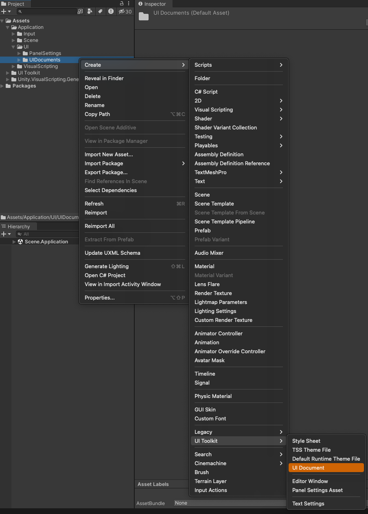
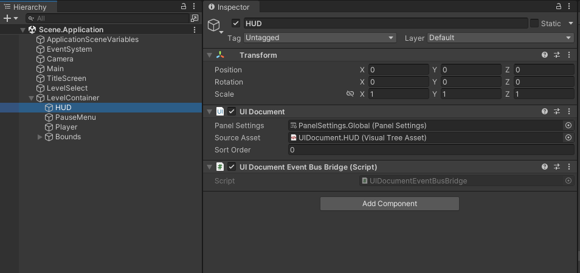
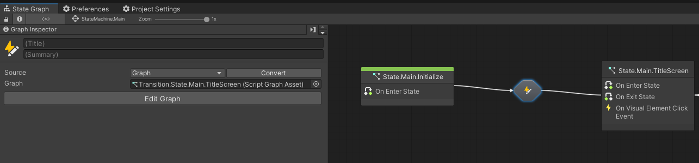

# Tutorial 01 - UI

- [Overview](#overview)
- [Project Setup](#project-setup)
- [UI Documents](#ui-documents)
  - [UI Documents Setup](#ui-documents-setup)
- [Scene Variables](#scene-variables)
- [Logic](#logic)
  - [Player](#player)
    - [Method.Player.ApplyMovement](#methodplayerapplymovement)
  - [The Main State Machine](#the-main-state-machine)
    - [Configurations](#configurations)
    - [Methods](#methods)
    - [Setting up the Main State Machine Assets.](#setting-up-the-main-state-machine-assets)
  - [Hooking up the Main State Machine](#hooking-up-the-main-state-machine)
    - [StateMachine.Main](#statemachinemain)
      - [State.Main.Initialize](#statemaininitialize)
      - [State.Main.TitleScreen](#statemaintitlescreen)
      - [State.Main.TitleScreen](#statemaintitlescreen-1)
    - [SuperState.Main.Level](#superstatemainlevel)
      - [State.Main.Level.Intro](#statemainlevelintro)
      - [State.Main.Level.Play](#statemainlevelplay)
      - [State.Main.Level.Outro](#statemainleveloutro)
      - [State.Main.Level.Pause](#statemainlevelpause)
- [Finish](#finish)

# Overview

In this tutorial we will build out some basic UI and functionalities for a game including a Title Screen, Level Select, Game HUD and Pause Menu.

# Project Setup

1. Import the OnChainStudios UIToolkitExtensions package through the Package Manager using the following URL and regenerate nodes.

   https://github.com/onchainstudios/onchainstudios-unity-extensions.git?path=/Packages/com.onchainstudios.uitoolkitextensions#v0.7.0-preview.15

2. Add onchainstudios.uitoolkitextensions.runtime to the Node Library in Project Settings->Visual Scripting->Node Library  

   

3. Add VisualElement to the Project Settings->Visual Scripting->Type Options list. 

   

4. Regenerate Nodes in Project Settings->Visual Scripting

   

5. In the InputActions.Controls asset, create a new Action Map called MenuControls and add an action "Pause" mapped to the "Escape" key.

   

   

# UI Documents

Unity's UIBuilder is a very versital toolset. An introduction to it can be found at the [UIBuilder getting started menual](https://docs.unity3d.com/Manual/UIB-getting-started.html).
Additionally the UI toolkit manual can be found here [UIToolkit Manual](https://docs.unity3d.com/Manual/UIElements.html)

## UI Documents Setup

1. Create the following folder structures in the Project
   1. Assets->Application->UI->PanelSettings
   2. Assets->Application->UI->UIDocuments

   

2. Create a [PanelSettings asset](https://docs.unity3d.com/Manual/UIE-Runtime-Panel-Settings.html) in the PanelSettings folder called `PanelSettings.Global`. This file is used to determine how your UI will react to resolution changes.

   

3. Set the properties of the panel settings as follows.

   

4. Drag and drop the 4 [UIDocuments](https://docs.unity3d.com/ScriptReference/UIElements.UIDocument.html) provided into the UIDocuments Folder. 

   

5. Double click a UIDocument to open it up and notice the inline styles and attributes show up in bold if they have been modified.

   

   

   

5. To create your own UIDocuments, Right click a folder to create them.
   
   

6. In the Scene Hierarchy create 4 new GameObject and attach the `UIDocument` and [UIDocumentEventBusBridge](https://github.com/onchainstudios/onchainstudios-unity-extensions/tree/development/Packages/com.onchainstudios.uitoolkitextensions/Documentation#ui-document-event-bus-bridge). Hook Up their respective PanelSettings, UIDocuments and set their sort orders accordingly.

   
   
   
   
   
   
   

# Scene Variables

1. Add the following [Scene Variables](https://github.com/onchainstudios/onchainstudios-unity-extensions/tree/development/Packages/com.onchainstudios.filetemplates/Documentation#scene-variables) to the project.

   

2. Make sure you have the following [Application Variables](https://github.com/onchainstudios/onchainstudios-unity-extensions/tree/development/Packages/com.onchainstudios.filetemplates/Documentation#application-variables) in your project.

   

# Logic

## Player

### Player.Behaviour

1. Update the Player.Behaviour script to check if the game is paused before capturing and applying the movement. Also refactor the capture of the input to only be in the update loop.

   

## The Main State Machine

StateMachine.Main is the main Finite State Machine that will run the application. We will be doing the all of the flow through the app with this state machine.
Documentation on state machines can be found [here](https://docs.unity3d.com/Packages/com.unity.visualscripting@1.8/manual/vs-graph-machine-types.html).
NOTE: We always use The Graph Source Type to make sure working with others goes smoothly. If you work on the same script graph or state machine as another person and check it into github it will result in merge conflicts and this will be nearly impossible to resolve just like any other unity asset (like scenes) and someone will have to redo their work.

### Configurations

1. Create the following [Configurations](https://github.com/onchainstudios/onchainstudios-unity-extensions/tree/development/Packages/com.onchainstudios.filetemplates/Documentation#configurations)

   

   

   

   

   

### Methods

1. Create the following [Methods](https://github.com/onchainstudios/onchainstudios-unity-extensions/tree/development/Packages/com.onchainstudios.filetemplates/Documentation#methods)

   

   

   

   

   

### Setting up the Main State Machine Assets.

1. Create a folder in the Assets->Application->Visual Scripting folder called `Main`

   

2. In the `Main` folder, create a [State Machine](https://github.com/onchainstudios/onchainstudios-unity-extensions/tree/development/Packages/com.onchainstudios.filetemplates/Documentation#state-machines) inside the main folder.

   

   

3. In the `Main` folder create the following [States](https://github.com/onchainstudios/onchainstudios-unity-extensions/tree/development/Packages/com.onchainstudios.filetemplates/Documentation#states) and [Transitions](https://github.com/onchainstudios/onchainstudios-unity-extensions/tree/development/Packages/com.onchainstudios.filetemplates/Documentation#transitions).

   

4. In the Assets-Application->VisualScripting->Main folder create the `SuperStates->Level` folder.

   

5. By right clicking the `Level` folder, create the SuperState.Main.Level [SuperState](https://github.com/onchainstudios/onchainstudios-unity-extensions/tree/development/Packages/com.onchainstudios.filetemplates/Documentation#super-states)

   

7. Inside the `Level` folder, create the following [States](https://github.com/onchainstudios/onchainstudios-unity-extensions/tree/development/Packages/com.onchainstudios.filetemplates/Documentation#states) and [Transitions](https://github.com/onchainstudios/onchainstudios-unity-extensions/tree/development/Packages/com.onchainstudios.filetemplates/Documentation#transitions).

   

## Hooking up the Main State Machine

### StateMachine.Main

1. Create a GameObject called `Main` in the Hierarchy and hook up StateMachine.Main to it using the State Machine component. Also hook up the PlayerInput component and set the default map to MenuControls.

   

2. Setup the StateMachine.Main.

   Transitions are named at the end with the name of the state they are going to so when hooking up the transitions you will drag the transition state with the same name as the direction of the arrow.

   

   

#### State.Main.Initialize

Fill out the State as follows:

#### State.Main.TitleScreen

Fill out the state as follows:

#### State.Main.TitleScreen

Fill out the state as follows:

### SuperState.Main.Level

Hook Up the Super State as follows

#### State.Main.Level.Intro

Fill out the state as follows:

#### State.Main.Level.Play

Fill out the state as follows:

#### State.Main.Level.Outro

Fill out the state as follows:

Fill out the state as follows:

#### State.Main.Level.Pause

Fill out the state as follows:

# Finish

You should now be able to run the game and traverse the menus. Additionally, hitting esc while in the "Level" will prevent the player from moving while "Paused".