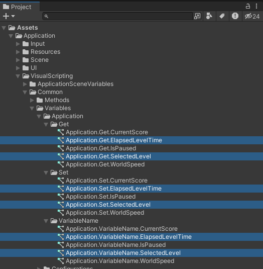
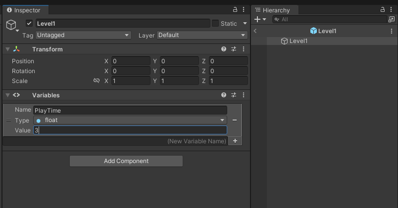

# Tutorial 03 - Levels

- [Overview](#overview)
- [Setup](#setup)
   - [Prefabs](#prefabs)
      - [Levels](#levels)
- [Visual Scripting](#visual-scripting)
   - [Application Variables](#application-variables)
   - [Configuration.Resources](#configurationresources)
   - [Level.PlayTime Object Variable](#levelplaytime-object-variable)
   - [Method.Main.SpawnLevel](#methodmainspawnlevel)
   - [Configuration.Main.LevelSelect](#configurationmainlevelselect)
   - [Method.Main.ResetGameData](#methodmainresetgamedata)
   - [State.Main.LevelSelect](#statemainlevelselect)
   - [State.Main.Level.Intro](#statemainlevelintro)
   - [State.Main.Level.Play](#statemainlevelplay)
   - [State.Main.Level.Outro](#statemainleveloutro)
   - [Finish](#finish)

# Overview

This tutorial serves as a starting point for spawning and destroying levels upon level select.

# Setup

## Prefabs

### Levels

1. Create an empty GameObject in the scene and call it Level1 and make it a prefab by dragging it into a folder Assets->Resources->Prefabs->Levels

    

2. Delete the Level1 GameObject out of the scene.

    

3. You can double click the Level1 Prefab to open it and add any GameObjects you want. Including backgrounds, Sprites, Spawners etc. We will get into Spawners in a later tutorial.

    

# Visual Scripting

## Application Variables

Add the `SelectedLevel` and `ElapsedLevelTime` application variables.

## Configuration.Resources

Create a configuration in the Common folder called `Configuration.Resources`

## Level.PlayTime Object Variable

1. When opened, add a Variables Component to the Level1 Prefab and add a PlayTime Object Variable.

   

1. Create a folder called "Level" under the main visual scripting folder.

   

2. Create a Object Variable getter.

   

3. Modify the Object.Get.Level.PlayTime to take a GameObject Data Input to can grab the value of play time off of the level we will spawn later.

   

## Method.Main.SpawnLevel

Create a new Method `Method.Main.SpawnLevel`

## Configuration.Main.LevelSelect

In the previously created `Configuration.Main.LevelSelect` script graph. Change the Level1ButtonName Key to `LevelButtonName` and change the string literal to `Level`.

## Method.Main.ResetGameData

Initialize the ElapsedLevelTime Application Variable in the `ResetGameData` method.

## State.Main.LevelSelect

1. Fix the Level Select click event and set the match rule to Visual Element Name Contains.

2. Set the `SelectedLevel` application variable to the visual element name. 

## State.Main.Level.Intro

Spawn the level and set the spawned level ApplicationSceneVariables.SpawnedLevel to the spawned level.

## State.Main.Level.Play

Add the functionality to wait for the PlayTime of the spawned level and transition to the outro state.

## State.Main.Level.Outro

Cleanup the spawned level by destroying it and transition back to the level select.

## Finish

You should now be able to create any number of levels and spawn them based on the level select screen by creating more level buttons and level prefabs. 